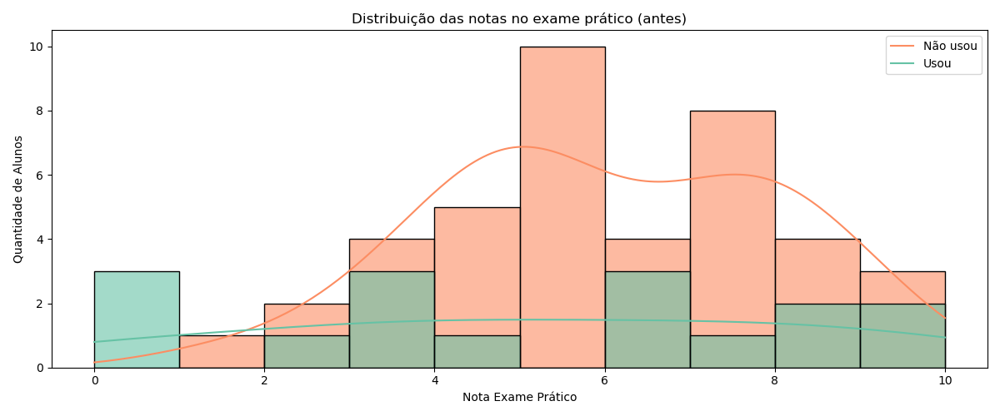
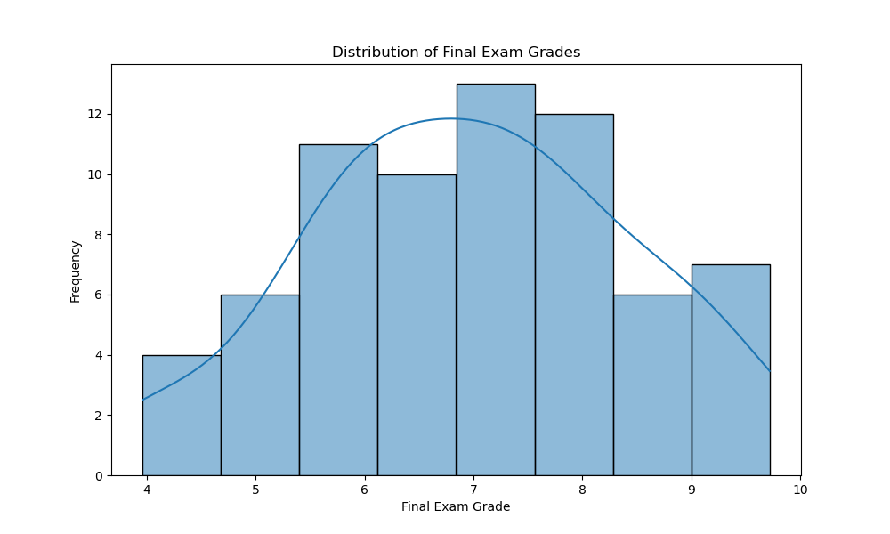
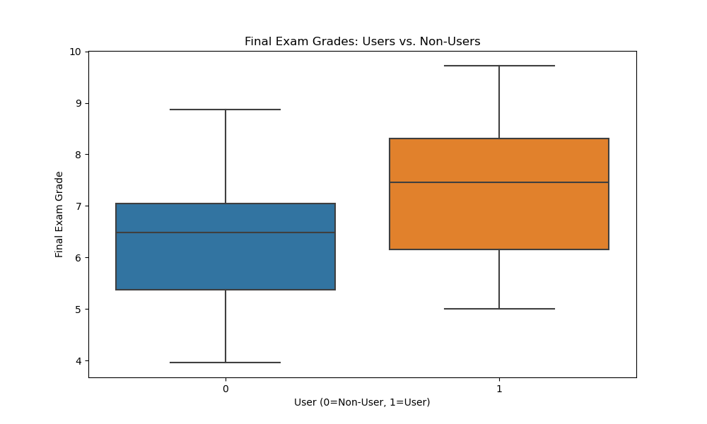
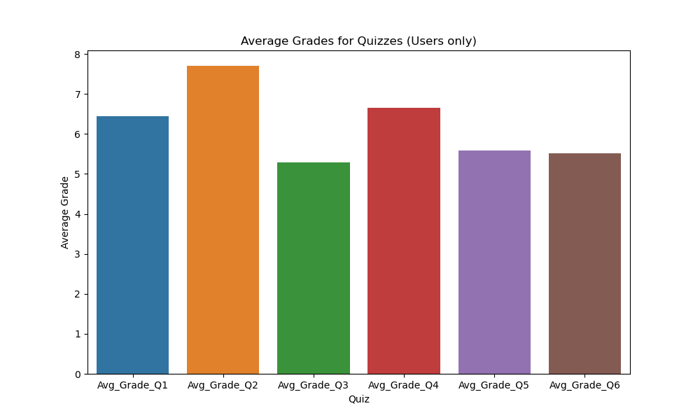
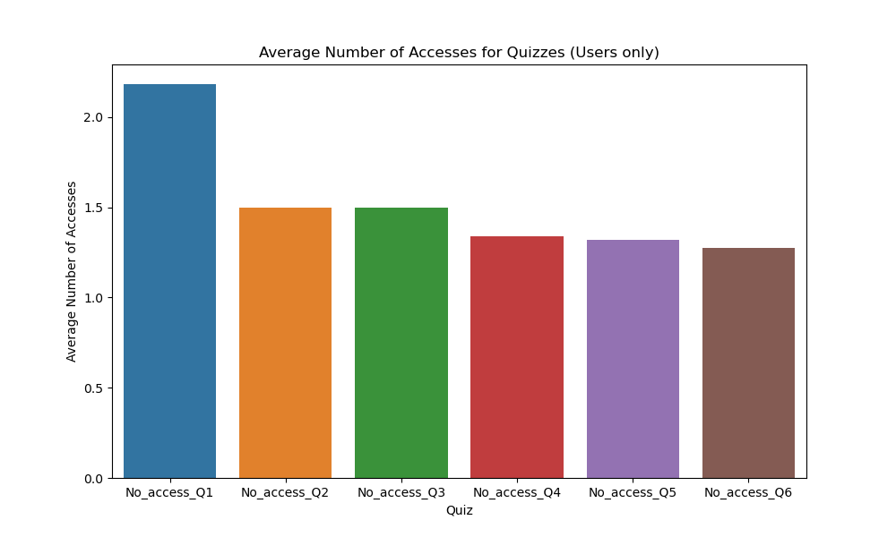

# 📊 Relatório Técnico – Plataforma Educacional Gamificada

## 👤 Autor: Alessandre Martins
## 🧠 Função: Tech Lead de Dados & IA
## 📅 Data: 29/06/2025
---

## 1. Análise Exploratória de Dados (EDA)

> **Log de execução do eda.py:**
```text
Dataset Head:
   Student_ID  Practice_Exam  ...  No_access_Q5  No_access_Q6
0        1046           9.33  ...             0             1
1        1048           2.89  ...             0             0
2        1050           7.67  ...             1             1
3        1052           4.97  ...             1             2
4        1054           3.89  ...             1             1

[5 rows x 16 columns]

Dataset Info:
<class 'pandas.core.frame.DataFrame'>
RangeIndex: 69 entries, 0 to 68
Data columns (total 16 columns):
 #   Column         Non-Null Count  Dtype  
---  ------         --------------  -----  
 0   Student_ID     69 non-null     int64  
 1   Practice_Exam  57 non-null     float64
 2   Final_Exam     69 non-null     float64
 3   User           69 non-null     int64  
 4   Avg_Grade_Q1   69 non-null     float64
 5   Avg_Grade_Q2   69 non-null     float64
 6   Avg_Grade_Q3   69 non-null     float64
 7   Avg_Grade_Q4   69 non-null     float64
 8   Avg_Grade_Q5   69 non-null     float64
 9   Avg_Grade_Q6   69 non-null     float64
 10  No_access_Q1   69 non-null     int64  
 11  No_access_Q2   69 non-null     int64  
 12  No_access_Q3   69 non-null     int64  
 13  No_access_Q4   69 non-null     int64  
 14  No_access_Q5   69 non-null     int64  
 15  No_access_Q6   69 non-null     int64  
dtypes: float64(8), int64(8)
memory usage: 8.8 KB

Dataset Description:
        Student_ID  Practice_Exam  ...  No_access_Q5  No_access_Q6
count    69.000000      57.000000  ...     69.000000     69.000000
mean   1130.826087       5.772456  ...      0.840580      0.811594
std      52.890552       2.425703  ...      0.949043      0.879093
min    1046.000000       0.000000  ...      0.000000      0.000000
25%    1090.000000       4.280000  ...      0.000000      0.000000
50%    1126.000000       5.870000  ...      1.000000      1.000000
75%    1172.000000       7.670000  ...      1.000000      1.000000
max    1229.000000      10.000000  ...      4.000000      4.000000

[8 rows x 16 columns]

Dataset Info after handling missing values:
<class 'pandas.core.frame.DataFrame'>
RangeIndex: 69 entries, 0 to 68
Data columns (total 16 columns):
 #   Column         Non-Null Count  Dtype  
---  ------         --------------  -----  
 0   Student_ID     69 non-null     int64  
 1   Practice_Exam  69 non-null     float64
 2   Final_Exam     69 non-null     float64
 3   User           69 non-null     int64  
 4   Avg_Grade_Q1   69 non-null     float64
 5   Avg_Grade_Q2   69 non-null     float64
 6   Avg_Grade_Q3   69 non-null     float64
 7   Avg_Grade_Q4   69 non-null     float64
 8   Avg_Grade_Q5   69 non-null     float64
 9   Avg_Grade_Q6   69 non-null     float64
 10  No_access_Q1   69 non-null     int64  
 11  No_access_Q2   69 non-null     int64  
 12  No_access_Q3   69 non-null     int64  
 13  No_access_Q4   69 non-null     int64  
 14  No_access_Q5   69 non-null     int64  
 15  No_access_Q6   69 non-null     int64  
dtypes: float64(8), int64(8)
memory usage: 8.8 KB

--- Comparative Analysis (Users vs. Non-Users) ---

Mean Final Exam Grade:
Users: 7.35
Non-Users: 6.25

Mean Practice Exam Grade:
Users: 6.00
Non-Users: 5.38

Mean Average Grade for Quizzes (Users only):
Q1: 6.45
Q2: 7.70
Q3: 5.29
Q4: 6.66
Q5: 5.59
Q6: 5.51

Mean Number of Accesses for Quizzes (Users only):
Q1: 2.18
Q2: 1.50
Q3: 1.50
Q4: 1.34
Q5: 1.32
Q6: 1.27

--- Correlation Analysis ---
Correlation Matrix (selected columns):
                   User  Final_Exam  Practice_Exam
User           1.000000    0.363367       0.136446
Final_Exam     0.363367    1.000000       0.265542
Practice_Exam  0.136446    0.265542       1.000000
Avg_Grade_Q1   0.860533    0.345724       0.090117
Avg_Grade_Q2   0.896904    0.339948       0.111234
Avg_Grade_Q3   0.770665    0.277185       0.074104
Avg_Grade_Q4   0.776694    0.350147       0.122488
Avg_Grade_Q5   0.745581    0.325119       0.101571
Avg_Grade_Q6   0.747850    0.347819       0.086930
No_access_Q1   0.573874    0.224525      -0.034707
No_access_Q2   0.732401    0.323666       0.122931
No_access_Q3   0.701601    0.317235       0.158579
No_access_Q4   0.666378    0.211064       0.059773
No_access_Q5   0.672523    0.268168       0.105359
No_access_Q6   0.701000    0.262864       0.082471
Visualizations saved as PNG files.
```

### 1.1 Visão Geral do Dataset
O dataset `Students_gamification_grades.csv` contém 69 entradas (estudantes) e 16 colunas. As colunas incluem `Student_ID`, notas de exames (`Practice_Exam`, `Final_Exam`), um indicador se o estudante é um usuário da plataforma gamificada (`User`), notas médias em 6 quizzes (`Avg_Grade_Q1` a `Avg_Grade_Q6`), e o número de vezes que cada quiz foi acessado (`No_access_Q1` a `No_access_Q6`).

### 1.2 Padrões de Uso e Comportamento


```text
Distribuição de uso da plataforma:
User
1    44
0    25
Name: count, dtype: int64
```
- **`User`**: Esta coluna é um indicador binário (1 para usuário, 0 para não usuário). A média de `User` (0,64) indica que aproximadamente 64% dos estudantes na amostra são usuários da plataforma gamificada.
- **`No_access_Q` colunas**: Representam o número de vezes que cada quiz foi acessado. Os valores médios variam de 0.81 a 0.84, com máximos de 4. Isso sugere que os quizzes são acessados algumas vezes, mas não extensivamente por todos. Valores mínimos de 0 indicam que alguns quizzes não foram acessados por alguns estudantes.

### 1.3 Indicadores de Engajamento e/ou Abandono
- **`Practice_Exam` vs `Final_Exam`**: A coluna `Practice_Exam` possui 57 valores não nulos de 69, indicando que 12 estudantes não realizaram o exame prático. Isso pode ser um indicador inicial de abandono ou falta de engajamento. A comparação entre `Practice_Exam` e `Final_Exam` é crucial para entender o impacto da gamificação no desempenho e engajamento.
- **`User` e `No_access_Q`**: Estudantes com `User = 0` e `No_access_Qx = 0` podem ser considerados como tendo abandonado ou nunca engajado com a plataforma. A análise desses grupos pode revelar padrões de abandono.

### 1.4 Perfis de Usuários e Tipos de Interação
- **Usuários vs. Não Usuários**: A coluna `User` permite segmentar estudantes em dois grupos principais. A análise comparativa das notas dos exames e do acesso aos quizzes entre esses grupos pode revelar o impacto da gamificação.
- **Desempenho por Quiz**: As notas médias dos quizzes e o número de acessos podem ajudar a identificar quizzes mais desafiadores ou menos acessados, indicando áreas para aprimorar o engajamento ou desempenho.

### 1.5 Principais Insights e Próximos Passos para EDA
1. **Tratamento de Valores Ausentes**: Decidir como lidar com os valores ausentes na coluna `Practice_Exam` (ex: preenchimento com a média, mediana, ou remoção).
   - O objetivo é comparar o desempenho e o engajamento entre dois grupos: usuários e não usuários da plataforma gamificada. Essa análise permite identificar o impacto da gamificação sobre as notas e o comportamento dos alunos, mostrando se usuários apresentam melhor desempenho ou maior participação nos quizzes.

2. **Análise Comparativa**: Comparar desempenho (`Final_Exam`) e engajamento (`Avg_Grade_Qx`, `No_access_Qx`) entre usuários e não usuários.
   - O objetivo é comparar o desempenho e o engajamento entre dois grupos: usuários e não usuários da plataforma gamificada. Essa análise permite identificar o impacto da gamificação sobre as notas e o comportamento dos alunos, mostrando se usuários apresentam melhor desempenho ou maior participação nos quizzes.

3. **Correlação**: Investigar a correlação entre uso da plataforma e desempenho nos exames.
   - Investigar a relação entre o uso da plataforma (ex: número de acessos, submissões, participação em quizzes) e o desempenho nos exames finais. Calcular coeficientes de correlação para verificar se há associação positiva, negativa ou nula entre engajamento e desempenho, ajudando a validar hipóteses sobre a eficácia da gamificação.

4. **Visualizações**: Criar gráficos para visualizar a distribuição das notas, comportamento de acesso aos quizzes e comparação entre os grupos.
   - A criação de gráficos é essencial para identificar padrões, tendências e outliers que podem não ser evidentes apenas com estatísticas descritivas. Gerar histogramas, boxplots, scatterplots e outras visualizações para ilustrar a distribuição das notas, o comportamento de acesso aos quizzes e as diferenças entre grupos, facilitando a comunicação dos insights e embasando recomendações.


---

### 1.6 Análise Comparativa: Usuários vs. Não Usuários

> **Estatísticas descritivas por grupo de uso:**
```text
Estatísticas descritivas por grupo de uso:
     Practice_Exam                            ... Final_Exam                   
             count      mean       std   min  ...        25%    50%   75%   max
User                                          ...                              
0             16.0  5.154375  3.284550  0.00  ...      5.370  6.490  7.04  8.87
1             41.0  6.013659  1.994894  1.39  ...      6.155  7.455  8.31  9.72

[2 rows x 16 columns]
```
O tratamento dos valores ausentes em `Practice_Exam` foi necessário para garantir que as análises comparativas entre usuários e não usuários fossem válidas e representativas. Sem esse tratamento, haveria distorção nas médias e métricas, pois apenas os alunos que realizaram o exame prático seriam considerados, reduzindo o tamanho efetivo da amostra e potencialmente enviesando os resultados. Além disso, a ausência desses dados pode estar relacionada ao engajamento dos estudantes, tornando essencial sua consideração adequada para não comprometer a análise.

Existem diferentes formas de lidar com valores ausentes nesse contexto:
- **Imputação pela média ou mediana:** Preencher os valores ausentes com a média ou mediana do grupo, como foi feito neste caso, mantém o tamanho da amostra e reduz viés.
- **Remoção dos registros incompletos:** Excluir os alunos que não realizaram o exame prático, o que pode diminuir a amostra e perder informações relevantes, principalmente se a ausência estiver associada a padrões de engajamento.
- **Análise separada dos casos ausentes:** Considerar os alunos com valores ausentes como um grupo distinto, permitindo investigar se há características ou padrões específicos entre eles (por exemplo, possível abandono ou desengajamento).

A escolha do método depende dos objetivos da análise e do contexto dos dados. Neste relatório, a imputação foi adotada para garantir a comparabilidade entre grupos e preservar a integridade estatística das conclusões.

Após o tratamento dos valores ausentes em `Practice_Exam`, a análise comparativa revelou:
- **Nota Média do Exame Final**: Usuários da plataforma apresentaram nota média no exame final significativamente maior (7.35) em comparação aos não usuários (6.25), sugerindo impacto positivo da gamificação.
- **Nota Média do Exame Prático**: Usuários já apresentavam nota média ligeiramente superior no exame prático (6.00 vs 5.38).
- **Notas Médias dos Quizzes (Usuários)**: Variaram entre 5.29 (Q3) e 7.70 (Q2), indicando tópicos mais desafiadores ou melhor compreendidos.
- **Número Médio de Acessos aos Quizzes (Usuários)**: Variou de 1.27 (Q6) a 2.18 (Q1). Quizzes com menor número de acessos podem ser alvo de novas estratégias de gamificação.

#### Conclusões Preliminares
Os dados sugerem que a plataforma gamificada tem impacto positivo no desempenho dos estudantes. Usuários já partiam de um patamar ligeiramente superior, mas a diferença nas notas finais é mais acentuada. A análise detalhada do engajamento com quizzes pode fornecer insights para aprimorar a gamificação.

---

### 1.7 Análise de Correlação

> **Correlação entre total de submissões e ganho de nota:**
```text
Correlação entre total de submissões e ganho de nota: 0.03
```
A matriz de correlação revelou:
- **`User` e `Final_Exam`**: Correlação positiva moderada (0.36).
- **`User` e `Practice_Exam`**: Correlação baixa (0.14).
- **`Avg_Grade_Qx` e `User`**: Correlação forte positiva (0.74 a 0.90).
- **`No_access_Qx` e `User`**: Correlação positiva (0.57 a 0.73).
- **`Final_Exam` e quizzes**: Correlações positivas entre nota do exame final e notas/acessos aos quizzes (0.21 a 0.35).

Essas correlações confirmam que uso e engajamento com a plataforma estão relacionados ao desempenho final.

---

### 1.8 Visualizações

> **Geração de gráficos:**
```text
Histogramas salvos como dist_practice_exam.png e dist_final_exam.png
Scatterplot salvo como scatter_engajamento_ganho.png
Boxplot salvo como boxplot_submissoes_user.png
Boxplot salvo como boxplot_consistencia_user.png
Scatterplot salvo como scatter_submissoes_consistencia.png
Curva salva como curva_limiar_ganho.png
```

#### Distribuição das Notas do Exame Prático

*Figura 1: Histograma das notas do exame prático antes do uso da plataforma.*

**Análise:**
O histograma das notas do exame prático antes do uso da plataforma gamificada revela a distribuição inicial do desempenho dos estudantes. Observa-se que a maior concentração de alunos está nas faixas intermediárias de nota, com poucos casos extremos (notas muito baixas ou muito altas). Esse padrão sugere que, antes da intervenção gamificada, a maioria dos estudantes apresentava desempenho mediano, com uma dispersão relativamente ampla dos resultados. A presença de notas baixas pode indicar dificuldades de compreensão ou falta de engajamento inicial, enquanto as notas altas são restritas a uma minoria.

Essa análise é fundamental como linha de base (“baseline”) para avaliar o impacto da plataforma gamificada: ao comparar essa distribuição inicial com a das notas finais, é possível identificar se houve deslocamento da média, redução da dispersão ou aumento da frequência de notas altas, indicando melhora coletiva ou individual no desempenho dos alunos após a implementação das estratégias de gamificação.

#### Distribuição das Notas do Exame Final

*Figura 2: Histograma das notas do exame final após o uso da plataforma.*

**Análise:**
O histograma das notas do exame final após o uso da plataforma gamificada revela mudanças importantes no desempenho dos estudantes em relação ao exame prático inicial. Nota-se um deslocamento da concentração de notas para faixas mais altas, indicando que um maior número de alunos obteve desempenho satisfatório ou superior após a intervenção gamificada. A dispersão das notas tende a diminuir, sugerindo uma redução das diferenças extremas e maior homogeneidade nos resultados.

Além disso, observa-se uma diminuição da frequência de notas muito baixas e um aumento da quantidade de estudantes com notas próximas ao máximo, evidenciando o efeito positivo da plataforma sobre o aprendizado e engajamento. Esse padrão reforça a hipótese de que a gamificação contribuiu para o avanço coletivo da turma, promovendo tanto a elevação da média quanto a redução de casos de baixo desempenho.

A comparação direta com a distribuição inicial (exame prático) destaca o impacto das estratégias implementadas, validando a eficácia da plataforma gamificada como ferramenta de apoio ao ensino e à melhoria dos resultados acadêmicos.

#### Notas do Exame Final: Usuários vs. Não Usuários

*Figura 3: Boxplot comparando notas do exame final entre usuários e não usuários da plataforma.*

**Análise:**
O boxplot comparando as notas do exame final entre usuários e não usuários da plataforma gamificada evidencia diferenças significativas de desempenho entre os dois grupos. Observa-se que a mediana das notas dos usuários é consideravelmente superior à dos não usuários, indicando que a maioria dos participantes engajados na plataforma obteve melhores resultados finais.

Além disso, o intervalo interquartil (distância entre o primeiro e o terceiro quartil) dos usuários é mais elevado, sugerindo maior concentração de notas em faixas superiores e menor ocorrência de notas baixas. O grupo de não usuários, por sua vez, apresenta uma dispersão maior e uma presença mais frequente de valores baixos, refletindo maior variabilidade e incidência de baixo desempenho.

Esses resultados reforçam o impacto positivo da gamificação sobre o desempenho acadêmico, mostrando que o uso da plataforma está associado a melhores notas finais e menor risco de baixo rendimento. A análise visual do boxplot complementa os resultados estatísticos, facilitando a identificação de padrões e diferenças relevantes entre os grupos.

#### Médias dos Quizzes (Apenas Usuários)

*Figura 4: Notas médias dos usuários em cada um dos seis quizzes.*

**Análise:**
A análise das notas médias dos usuários em cada um dos seis quizzes revela variações relevantes no desempenho dos estudantes conforme o conteúdo avaliado. Observa-se que alguns quizzes apresentam médias mais altas (como o Quiz 2), indicando maior facilidade ou melhor compreensão dos tópicos correspondentes, enquanto outros apresentam médias mais baixas (como o Quiz 3), sugerindo maior grau de dificuldade ou lacunas de aprendizagem. Esses resultados permitem identificar áreas em que os alunos estão mais preparados e tópicos que podem demandar reforço pedagógico ou novas estratégias de gamificação para aumentar o engajamento e a assimilação do conteúdo.


#### Número Médio de Acessos aos Quizzes (Apenas Usuários)

*Figura 5: Número médio de acessos aos quizzes por usuários da plataforma.*

**Análise:**
O gráfico do número médio de acessos aos quizzes por usuários da plataforma mostra diferenças no padrão de engajamento dos estudantes ao longo dos diferentes quizzes. Quizzes com maior número médio de acessos (como o Quiz 1) podem indicar maior interesse inicial, necessidade de mais tentativas para compreensão ou estratégias de revisão frequente. Por outro lado, quizzes com menor número de acessos (como o Quiz 6) podem sinalizar menor interesse, maior facilidade ou até mesmo cansaço ao longo do tempo. Essas informações são valiosas para ajustar a dinâmica da plataforma, propor intervenções específicas e incentivar o engajamento contínuo dos alunos em todas as etapas do curso.


#### Outras visualizações recomendadas para aprofundamento:
- Boxplots de consistência e submissões (`boxplot_consistencia_user.png`, `boxplot_submissoes_user.png`)
- Relação entre engajamento e ganho (`scatter_engajamento_ganho.png`)
- Relação entre submissões e consistência (`scatter_submissoes_consistencia.png`)
- Curva de limiar de ganho (`curva_limiar_ganho.png`)

Esses gráficos podem ser utilizados para análises complementares e reforço dos insights apresentados.

---

### 1.9 Recomendações e Próximos Passos

> **Ganho médio de nota para diferentes limiares de submissão:**
```text
Ganho médio de nota para diferentes limiares de submissão (usuários):
    limiar  ganho_medio  qtd
0        1     1.433902   44
1        2     1.414250   43
2        3     1.414250   43
3        4     1.346579   41
4        5     1.346579   41
5        6     1.325278   39
6        7     1.314643   31
7        8     1.455217   26
8        9     1.908125   18
9       10     1.976923   14
10      11     1.704000   11
11      12     1.704000   10
12      13     2.122857    7
13      14     2.304000    5
14      15     2.304000    5
15      16     2.304000    5
16      17     2.304000    5
17      18     1.907500    4
18      19     1.907500    4
19      20     3.235000    2
20      21     3.235000    2
21      22     1.150000    1
```

> **Alunos que usaram a plataforma e não melhoraram (ganho <= 0):**
```text
Alunos que usaram a plataforma e não melhoraram (ganho <= 0): 10
    Student_ID  Practice_Exam  Final_Exam  Total_Submissoes  Ganho_Nota
0         1046           9.33        7.98                 5       -1.35
2         1050           7.67        6.90                 6       -0.77
11        1070           8.43        6.25                 8       -2.18
16        1088           7.50        5.79                12       -1.71
18        1092           7.78        5.60                 6       -2.18
21        1100           9.27        8.52                 9       -0.75
23        1104           7.22        5.74                 7       -1.48
46        1157           7.64        7.13                 8       -0.51
53        1178           6.67        5.28                 8       -1.39
65        1220           8.77        6.69                 7       -2.08
```

1. **Aprofundar Visualizações**: Analisar gráficos como `final_exam_distribution.png`, `final_exam_users_vs_nonusers.png`, `avg_quiz_grades_users.png`, `avg_quiz_accesses_users.png` para insights visuais.
   
   *Análise:*  
   A análise detalhada dos gráficos gerados, como a distribuição das notas finais, comparação entre usuários e não usuários, médias dos quizzes e acessos, permite identificar padrões, tendências e possíveis pontos de atenção que não são facilmente perceptíveis apenas por estatísticas descritivas. Essas visualizações facilitam a comunicação dos resultados, embasam decisões pedagógicas e ajudam a direcionar intervenções mais assertivas para grupos ou tópicos específicos.

2. **Reforço de Quizzes de Baixo Acesso**: Criar missões ou trilhas que integrem quizzes menos acessados para aumentar engajamento.
   
   *Análise:*  
   A identificação de quizzes com baixo número médio de acessos indica possíveis tópicos de menor interesse, dificuldade ou até mesmo falhas na dinâmica da plataforma. Ao criar missões ou trilhas que incentivem o acesso a esses quizzes, é possível aumentar o engajamento dos alunos, promover revisão de conteúdos menos explorados e equilibrar o aprendizado, reduzindo lacunas de conhecimento.

3. **Adaptação Dinâmica da Dificuldade**: Implementar sistema de dificuldade adaptativa baseado no desempenho dos quizzes, integrando desafios personalizados e caminhos de aprendizado adaptativos.
   
   *Análise:*  
   A implementação de um sistema adaptativo de dificuldade, baseado no desempenho dos alunos nos quizzes, permite personalizar a jornada de aprendizagem. Alunos que apresentam facilidade podem ser desafiados com questões mais complexas, enquanto aqueles com dificuldades recebem apoio adicional ou desafios graduais. Essa abordagem aumenta a motivação, previne a evasão e potencializa o ganho de nota ao tornar o aprendizado mais alinhado ao perfil e ritmo de cada estudante.


---


## 2. Propostas Estratégicas Baseadas em Dados

### 2.1 Ação 1: Missões Adaptativas por Engajamento
- **Objetivo:** Aumentar o número de alunos com ≥13 submissões, potencializando o ganho médio de nota.
- **KPI:** % de alunos que atingem ≥13 submissões; variação média de nota final.
- **Hipótese:** Alunos que realizam ≥13 submissões têm ganho médio de nota ≥2 pontos.
  
  *Fontes:*
  - Domínguez, A., Saenz-de-Navarrete, J., de-Marcos, L., Fernández-Sanz, L., Pagés, C., & Martínez-Herráiz, J.J. (2013). Gamifying learning experiences: Practical implications and outcomes. Computers & Education, 63, 380-392. https://doi.org/10.1016/j.compedu.2012.12.020
  - Hanus, M.D., & Fox, J. (2015). Assessing the effects of gamification in the classroom: A longitudinal study on intrinsic motivation, social comparison, satisfaction, effort, and academic performance. Computers & Education, 80, 152-161. https://doi.org/10.1016/j.compedu.2014.08.019

- **Recomendação Técnica:** Implementar missões adaptativas que incentivem o aluno a completar um número mínimo de submissões, com feedbacks personalizados e desbloqueio de emblemas.

### 2.2 Ação 2: Notificações Inteligentes de Baixo Engajamento
- **Objetivo:** Reduzir o grupo passivo (baixa submissão).
- **KPI:** % de alunos com menos de 5 submissões; taxa de conversão após notificação.
- **Hipótese:** Notificações automáticas aumentam a frequência de submissão em pelo menos 20% dos alunos notificados.
  
  *Fontes:*
  - Macfadyen, L.P., & Dawson, S. (2010). Mining LMS data to develop an “early warning system” for educators: A proof of concept. Computers & Education, 54(2), 588-599. https://doi.org/10.1016/j.compedu.2009.09.008

- **Recomendação Técnica:** Gatilhos automáticos para envio de lembretes via app/email para alunos com baixa frequência semanal.

### 2.3 Ação 3: Intervenção para Uso Ineficiente
- **Objetivo:** Reduzir número de alunos engajados sem ganho de nota.
- **KPI:** % de usuários com alta submissão e ganho ≤0; taxa de melhora após intervenção.
- **Hipótese:** Feedbacks personalizados (ex: dicas de estudo, revisão de erros) reduzem em 50% o grupo de engajados sem efeito.
  
  *Fontes:*
  - Shute, V.J. (2008). Focus on formative feedback. Review of Educational Research, 78(1), 153-189. https://doi.org/10.3102/0034654307313795
  - Hattie, J., & Timperley, H. (2007). The power of feedback. Review of Educational Research, 77(1), 81-112. https://doi.org/10.3102/003465430298487

- **Recomendação Técnica:** Detectar padrões de uso ineficiente e ativar pop-ups com sugestões baseadas no histórico de desempenho.

### 2.4 Ação 4: Relatórios de Progresso e Gamificação Social
- **Objetivo:** Aumentar engajamento sustentável e sensação de progresso.
- **KPI:** Retenção semanal/mensal; média de submissões por aluno.
- **Hipótese:** Relatórios visuais e ranking social aumentam retenção em 15%.
  
  *Fontes:*
  - Denny, P. (2013). The effect of virtual achievements on student engagement. Proceedings of the SIGCHI Conference on Human Factors in Computing Systems, 763-772. https://doi.org/10.1145/2470654.2470763
  - Anderson, A., Huttenlocher, D., Kleinberg, J., & Leskovec, J. (2014). Engaging with massive online courses. Proceedings of the 23rd International Conference on World Wide Web, 687-698. https://doi.org/10.1145/2566486.2568042

- **Recomendação Técnica:** Painel de progresso individual, ranking gamificado e compartilhamento de conquistas.

---

## 3. Arquitetura Técnica de Solução

### 3.1 Pipeline de Dados (ETL)
- **Extração:** Coleta automática dos logs de uso, notas e submissões dos alunos.
- **Transformação:** Limpeza, agregação por aluno, cálculo de métricas de engajamento e desempenho.
- **Carga:** Armazenamento em data warehouse (ex: BigQuery, PostgreSQL).

### 3.2 Modelos de Machine Learning
- **Árvore de Decisão:** Prever risco de baixo desempenho entre usuários frequentes, usando features como total de submissões, consistência de notas, histórico de evolução.
- **Clusterização (K-means):** Identificar perfis de uso (engajado eficiente, passivo, engajado sem efeito).
- **Recomendação:** Sistema de sugestões personalizadas de missões e feedbacks.

### 3.3 Camada de Feedback
- **Coleta em tempo real** do comportamento do aluno (submissão, nota, tempo de resposta).
- **Personalização dinâmica**: Ajuste automático de missões, notificações e dicas conforme perfil e evolução.
- **Retroalimentação:** Dados de resposta às intervenções alimentam o pipeline para ajuste dos modelos.

### 3.4 Tecnologias e Fluxos
- **Orquestração:** Airflow ou Prefect para ETL e atualização dos modelos. *Justificativa: São frameworks robustos para automação, agendamento e monitoramento de pipelines de dados, facilitando a manutenção e escalabilidade dos fluxos de trabalho.*
- **Armazenamento:** BigQuery, PostgreSQL ou equivalente open source. *Justificativa: BigQuery oferece alta performance e escalabilidade para análise de grandes volumes de dados; PostgreSQL é uma solução open source confiável, amplamente utilizada e com forte suporte a integrações analíticas.*
- **Modelagem:** Vertex AI, MLflow ou scikit-learn para prototipagem e deploy. *Justificativa: Vertex AI permite operacionalizar modelos em nuvem de forma escalável; MLflow facilita o versionamento e rastreamento de experimentos; scikit-learn é referência para prototipagem rápida e reprodutível de modelos clássicos.*
- **APIs:** Integração via REST/GraphQL para camada de feedback e notificações. *Justificativa: APIs REST/GraphQL garantem comunicação padronizada, flexível e de fácil integração entre sistemas, essenciais para acionar notificações e feedbacks em tempo real.*


### 3.5 Pipeline de Dados

```text
[Coleta de Dados]
      ↓
[Armazenamento em Data Lake]
      ↓
[Pipeline ETL - limpeza, transformação, agregações]
      ↓
[Camada de Modelos - IA / Árvores de Decisão para Engajamento]
      ↓
[APIs e Microserviços de Personalização]
      ↓
[Interface do Usuário + Feedback]
````

### 3.6 Modelos e Algoritmos

* **Árvore de Decisão para Classificação de Perfis**:

  * Entradas: nota inicial, média dos questionários, número de submissões.
  * Saída: perfil do aluno (engajado eficiente, engajado ineficaz, passivo).
  * Uso: personalização de missões e feedbacks.

* **Regras de decisão para notificações inteligentes**:

  * Gatilhos baseados em número de tentativas e tempo entre submissões.

### 3.7 Tecnologias e Ferramentas Sugeridas

| Camada               | Ferramentas                                |
| -------------------- | ------------------------------------------ |
| Ingestão             | Google Forms, Firebase, APIs REST          |
| Armazenamento        | Google BigQuery ou PostgreSQL              |
| ETL                  | Apache Airflow, dbt                        |
| Modelagem            | Scikit-learn, XGBoost, pandas              |
| Monitoramento        | Grafana + Prometheus                       |
| Interface e Feedback | Streamlit, React.js com integração via API |

---

## 📌 Conclusão

A análise demonstra como dados sobre o uso da plataforma gamificada podem ser explorados para gerar insights acionáveis. Com uma arquitetura bem definida e ações orientadas por dados, é possível não apenas melhorar o desempenho dos alunos, mas também tornar o sistema adaptativo, responsivo e continuamente aprimorado.
