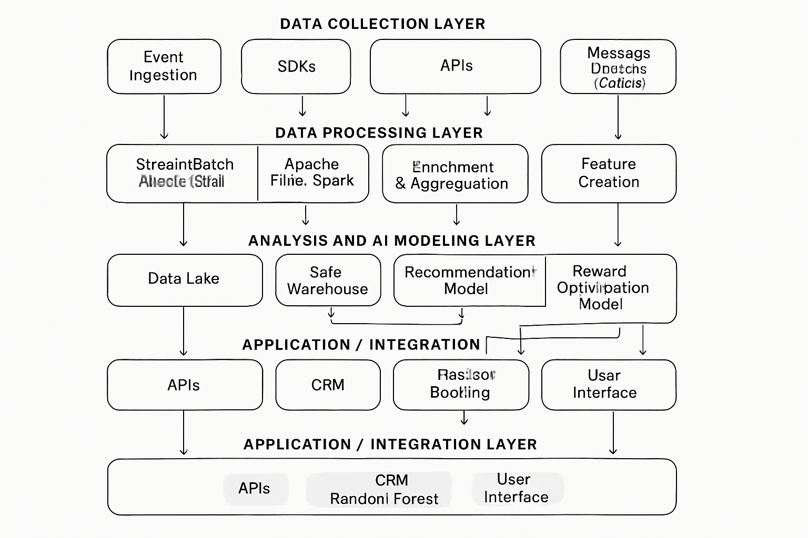

## Análise Exploratória de Dados (EDA) Inicial

### Visão Geral do Dataset

O dataset `Students_gamification_grades.csv` contém 69 entradas (estudantes) e 16 colunas. As colunas incluem `Student_ID`, notas de exames (`Practice_Exam`, `Final_Exam`), um indicador se o estudante é um usuário da plataforma gamificada (`User`), notas médias em 6 quizzes (`Avg_Grade_Q1` a `Avg_Grade_Q6`), e o número de vezes que cada quiz foi acessado (`No_access_Q1` a `No_access_Q6`).

### Padrões de Uso e Comportamento

- **`User`**: Esta coluna é um indicador binário (1 para usuário, 0 para não usuário). A média de `User` (0.695652) indica que aproximadamente 70% dos estudantes na amostra são usuários da plataforma gamificada.
- **`No_access_Q` colunas**: Estas colunas representam o número de vezes que cada quiz foi acessado. Os valores médios variam de 0.81 a 0.84, com máximos de 4. Isso sugere que os quizzes são acessados algumas vezes, mas não extensivamente por todos os usuários. A presença de valores mínimos de 0 indica que alguns quizzes não foram acessados por alguns estudantes.

### Indicadores de Engajamento e/ou Abandono

- **`Practice_Exam` vs `Final_Exam`**: A coluna `Practice_Exam` possui 57 valores não nulos de 69, indicando que 12 estudantes não realizaram o exame prático. Isso pode ser um indicador inicial de abandono ou falta de engajamento antes mesmo de usar a plataforma. A comparação entre `Practice_Exam` e `Final_Exam` será crucial para entender o impacto da gamificação no desempenho e engajamento.
- **`User` e `No_access_Q`**: Estudantes com `User = 0` (não usuários) e `No_access_Qx = 0` (nenhum acesso aos quizzes) podem ser considerados como tendo abandonado ou nunca engajado com a plataforma gamificada. A análise desses grupos pode revelar padrões de abandono.

### Perfis de Usuários e Tipos de Interação com o Sistema

- **Usuários vs. Não Usuários**: A coluna `User` permite a segmentação dos estudantes em dois grupos principais: aqueles que utilizaram a plataforma gamificada e aqueles que não. A análise comparativa das notas dos exames e do acesso aos quizzes entre esses grupos pode revelar o impacto da gamificação.
- **Desempenho por Quiz**: As notas médias dos quizzes (`Avg_Grade_Q1` a `Avg_Grade_Q6`) e o número de acessos (`No_access_Q1` a `No_access_Q6`) podem ajudar a identificar quais quizzes são mais desafiadores ou menos acessados, indicando áreas onde a gamificação pode ser aprimorada para aumentar o engajamento ou o desempenho.

### Próximos Passos para EDA:

1.  **Tratamento de Valores Ausentes**: Decidir como lidar com os valores ausentes na coluna `Practice_Exam` (e.g., preenchimento com a média, mediana, ou remoção, dependendo da análise).
2.  **Análise Comparativa**: Comparar o desempenho (`Final_Exam`) e o engajamento (`Avg_Grade_Qx`, `No_access_Qx`) entre usuários e não usuários da plataforma gamificada.
3.  **Correlação**: Investigar a correlação entre o uso da plataforma (`User`, `No_access_Qx`) e o desempenho nos exames (`Practice_Exam`, `Final_Exam`).
4.  **Visualizações**: Criar gráficos para visualizar a distribuição das notas, o comportamento de acesso aos quizzes e a comparação entre os grupos de usuários.

### Análise Comparativa: Usuários vs. Não Usuários

Após o tratamento dos valores ausentes na coluna `Practice_Exam` (preenchidos com a média), a análise comparativa entre usuários e não usuários da plataforma gamificada revelou os seguintes insights:

- **Nota Média do Exame Final (`Final_Exam`)**: Usuários da plataforma gamificada (`User = 1`) apresentaram uma nota média no exame final significativamente maior (7.35) em comparação com os não usuários (`User = 0`), que obtiveram uma média de 6.25. Isso sugere um impacto positivo da gamificação no desempenho acadêmico.
- **Nota Média do Exame Prático (`Practice_Exam`)**: Antes mesmo da utilização da plataforma, os usuários já apresentavam uma nota média ligeiramente superior no exame prático (6.00) em relação aos não usuários (5.38). Embora a diferença seja menor que no exame final, isso pode indicar que os usuários já possuíam um nível de engajamento ou aptidão inicial um pouco maior.
- **Notas Médias dos Quizzes (Apenas Usuários)**: As notas médias dos quizzes para os usuários da plataforma variaram entre 5.29 (Q3) e 7.70 (Q2). Isso indica que, mesmo entre os usuários, há variações no desempenho em diferentes tópicos ou quizzes, o que pode ser explorado para identificar áreas de melhoria na gamificação.
- **Número Médio de Acessos aos Quizzes (Apenas Usuários)**: O número médio de acessos aos quizzes pelos usuários variou de 1.27 (Q6) a 2.18 (Q1). Isso mostra que os quizzes são acessados, mas o engajamento em termos de repetição não é extremamente alto. Quizzes com menor número de acessos podem ser alvos para novas estratégias de gamificação para incentivar a repetição e o aprofundamento.

### Conclusões Preliminares da Análise Comparativa:

Os dados sugerem que a plataforma gamificada tem um impacto positivo no desempenho dos estudantes, conforme evidenciado pela diferença nas notas do exame final. No entanto, é importante considerar que os usuários já partiam de um patamar ligeiramente superior no exame prático. A análise detalhada do engajamento com os quizzes (notas e acessos) pode fornecer insights sobre quais elementos de gamificação são mais eficazes e onde há oportunidades para aumentar ainda mais o engajamento.

### Próximos Passos para EDA:

1.  **Análise de Correlação**: Investigar a correlação entre o uso da plataforma (`User`, `No_access_Qx`) e o desempenho nos exames (`Practice_Exam`, `Final_Exam`).
2.  **Visualizações**: Criar gráficos para visualizar a distribuição das notas, o comportamento de acesso aos quizzes e a comparação entre os grupos de usuários para reforçar as descobertas.

### Análise de Correlação

A matriz de correlação (para colunas selecionadas) revela as seguintes relações:

- **`User` e `Final_Exam`**: Há uma correlação positiva moderada (0.36) entre ser um usuário da plataforma gamificada e a nota do exame final. Isso reforça a observação de que a gamificação está associada a um melhor desempenho.
- **`User` e `Practice_Exam`**: A correlação entre ser usuário e a nota do exame prático é baixa (0.14), o que sugere que a diferença no desempenho inicial entre usuários e não usuários não é o principal fator para a diferença nas notas finais.
- **`Avg_Grade_Qx` e `User`**: As notas médias dos quizzes (`Avg_Grade_Q1` a `Avg_Grade_Q6`) mostram uma forte correlação positiva com a variável `User` (variando de 0.74 a 0.90). Isso é esperado, pois apenas usuários da plataforma têm notas nesses quizzes. No entanto, isso também indica que o engajamento com os quizzes é um forte indicador de ser um usuário ativo.
- **`No_access_Qx` e `User`**: O número de acessos aos quizzes (`No_access_Q1` a `No_access_Q6`) também apresenta correlação positiva com a variável `User` (variando de 0.57 a 0.73). Similarmente às notas, isso é um reflexo do uso da plataforma, mas também sugere que a frequência de acesso aos quizzes está ligada ao status de usuário.
- **`Final_Exam` e `Avg_Grade_Qx` / `No_access_Qx`**: Há correlações positivas entre a nota do exame final e as notas médias dos quizzes (variando de 0.28 a 0.35) e o número de acessos aos quizzes (variando de 0.21 a 0.32). Isso indica que um maior engajamento e desempenho nos quizzes da plataforma gamificada estão associados a melhores notas no exame final.

### Resumo das Correlações:

As correlações confirmam que o uso da plataforma gamificada e o engajamento com seus elementos (quizzes e acessos) estão positivamente relacionados ao desempenho no exame final. A correlação mais forte é entre ser usuário e as notas/acessos aos quizzes, o que é um bom sinal de que a plataforma está sendo utilizada conforme o esperado pelos usuários.

### Próximos Passos para EDA:

1.  **Visualizações**: Analisar as visualizações geradas (`final_exam_distribution.png`, `final_exam_users_vs_nonusers.png`, `avg_quiz_grades_users.png`, `avg_quiz_accesses_users.png`) para extrair insights visuais e adicioná-los ao relatório.

### Visualizações

#### Distribuição das Notas do Exame Final

O histograma `final_exam_distribution.png` mostra que as notas do exame final estão distribuídas em torno de uma média, com a maioria dos estudantes obtendo notas entre 6 e 8. A distribuição parece ser aproximadamente normal, com uma leve inclinação para notas mais altas, o que é um bom indicativo do desempenho geral dos estudantes.

#### Notas do Exame Final: Usuários vs. Não Usuários

O boxplot `final_exam_users_vs_nonusers.png` visualiza claramente a diferença nas notas do exame final entre usuários e não usuários. A caixa para usuários (User=1) está visivelmente mais alta do que a caixa para não usuários (User=0), com uma mediana mais elevada e uma distribuição geral de notas mais altas. Isso corrobora a análise estatística de que usuários da plataforma gamificada tendem a ter um desempenho superior no exame final.

#### Notas Médias dos Quizzes (Apenas Usuários)

O gráfico de barras `avg_quiz_grades_users.png` ilustra as notas médias dos usuários em cada um dos seis quizzes. Observa-se que o Quiz 2 (`Avg_Grade_Q2`) tem a nota média mais alta (7.70), enquanto o Quiz 3 (`Avg_Grade_Q3`) tem a nota média mais baixa (5.29). Isso pode indicar que o Quiz 2 é mais fácil ou mais bem compreendido pelos usuários, enquanto o Quiz 3 pode ser mais desafiador ou exigir melhorias no conteúdo ou na forma como é apresentado.

#### Número Médio de Acessos aos Quizzes (Apenas Usuários)

O gráfico de barras `avg_quiz_accesses_users.png` mostra o número médio de vezes que os usuários acessaram cada quiz. O Quiz 1 (`No_access_Q1`) foi o mais acessado (2.18 vezes em média), enquanto o Quiz 6 (`No_access_Q6`) foi o menos acessado (1.27 vezes em média). Isso pode indicar que o Quiz 1 é mais popular ou mais necessário para os usuários, enquanto o Quiz 6 pode precisar de incentivos adicionais para aumentar o engajamento.

### Conclusões Finais da EDA:

A análise exploratória de dados revelou que a plataforma gamificada parece ter um impacto positivo no desempenho dos estudantes, com usuários obtendo notas mais altas no exame final. O engajamento com os quizzes, tanto em termos de notas quanto de acessos, está correlacionado com o status de usuário e o desempenho final. Existem variações no engajamento e desempenho entre os diferentes quizzes, o que oferece oportunidades para otimização da gamificação.

## 3. Propostas Estratégicas Baseadas em Dados

Com base nas análises exploratórias realizadas, que demonstraram o impacto positivo da gamificação no engajamento e desempenho dos estudantes, e identificaram áreas de maior e menor interação, propõem-se as seguintes ações estratégicas para potencializar ainda mais o engajamento de usuários em plataformas digitais com elementos de gamificação:

### 3.1. Incentivo ao Engajamento de Não Usuários e Prevenção de Abandono

**Insight**: A diferença significativa nas notas do exame final entre usuários e não usuários, mesmo com uma pequena diferença inicial no exame prático, sugere que a gamificação é um fator chave para o sucesso. Além disso, a presença de valores ausentes no `Practice_Exam` para alguns estudantes pode indicar um abandono precoce.

**Proposta Estratégica**: Implementar estratégias de engajamento direcionadas a usuários que demonstram baixo engajamento inicial ou que ainda não se tornaram usuários ativos da plataforma. Isso pode incluir:

*   **Onboarding Gamificado**: Criar uma experiência de onboarding altamente gamificada para novos usuários, com missões iniciais simples e recompensas imediatas para familiarizá-los com as funcionalidades da plataforma e incentivá-los a se tornarem usuários ativos. Por exemplo, um tutorial interativo que recompensa o usuário por completar cada etapa, culminando em um distintivo de "Explorador Iniciante".
*   **Notificações Personalizadas e Desafios de Reengajamento**: Utilizar dados de comportamento (e.g., tempo desde o último login, quizzes não acessados) para enviar notificações push personalizadas com desafios curtos e recompensadores. Para estudantes que não realizaram o `Practice_Exam` ou que não acessaram nenhum quiz, oferecer "missões de resgate" com bônus de pontuação ou recompensas exclusivas para incentivá-los a retornar e interagir com o conteúdo.
*   **Programas de Mentoria ou "Parceiro de Estudo"**: Conectar novos usuários ou usuários com baixo engajamento a usuários mais experientes e engajados. A gamificação pode ser aplicada aqui através de recompensas para mentores que ajudam seus "pupilos" a atingir marcos de engajamento, criando um senso de comunidade e responsabilidade mútua.

### 3.2. Otimização do Conteúdo e Dificuldade dos Quizzes

**Insight**: A variação nas notas médias e no número de acessos entre os quizzes (e.g., Quiz 2 com alta nota média, Quiz 3 com baixa nota média; Quiz 1 com mais acessos, Quiz 6 com menos acessos) indica que nem todos os conteúdos ou formatos de quiz são igualmente eficazes ou atraentes.

**Proposta Estratégica**: Realizar uma análise aprofundada dos quizzes com base nos dados de desempenho e engajamento para otimizar o conteúdo e a dificuldade:

*   **Revisão de Quizzes de Baixo Desempenho**: Para quizzes como o Quiz 3, que apresentou a menor nota média, investigar o conteúdo, a clareza das perguntas e a relevância para o material de estudo. A gamificação pode ser usada para incentivar a revisão de tópicos relacionados a esses quizzes, oferecendo "desafios de maestria" com recompensas progressivas por alcançar pontuações mais altas.
*   **Reforço de Quizzes de Baixo Acesso**: Para quizzes como o Quiz 6, que teve o menor número de acessos, criar missões ou trilhas de aprendizado que integrem esses quizzes de forma mais proeminente. Por exemplo, "Trilhas de Conhecimento" que exigem a conclusão de todos os quizzes de um determinado módulo para desbloquear uma recompensa maior ou um novo nível.
*   **Adaptação Dinâmica da Dificuldade**: Utilizar os dados de desempenho dos quizzes para implementar um sistema de dificuldade adaptativa. Se um usuário consistentemente obtém notas altas em um tipo de quiz, o sistema pode apresentar desafios mais complexos ou missões de "nível avançado". Se o desempenho for baixo, o sistema pode sugerir materiais de revisão ou quizzes mais simples para reforçar o aprendizado, tudo isso integrado com elementos de gamificação como "desafios personalizados" ou "caminhos de aprendizado adaptativos".

### 3.3. Personalização da Experiência Gamificada

**Insight**: Embora a gamificação geral seja eficaz, a análise individualizada do comportamento do usuário pode revelar preferências e necessidades específicas que podem ser exploradas para uma personalização mais profunda.

**Proposta Estratégica**: Desenvolver um sistema de personalização da experiência gamificada com base nos dados do usuário:

*   **Perfis de Jogador**: Criar perfis de jogador baseados no comportamento de engajamento (e.g., "Caçador de Conquistas" para quem busca distintivos, "Competidor" para quem foca em rankings, "Explorador" para quem acessa diversos conteúdos). A plataforma pode então sugerir missões, recompensas e desafios que se alinhem com o perfil de cada usuário.
*   **Recomendações de Conteúdo Gamificado**: Utilizar algoritmos de recomendação (baseados em colaboração ou conteúdo) para sugerir quizzes, missões ou trilhas de aprendizado que sejam relevantes para os interesses e lacunas de conhecimento do usuário, apresentando-os como "desafios recomendados" ou "jornadas de aprendizado personalizadas".
*   **Feedback Personalizado e Progressão**: Fornecer feedback mais detalhado e personalizado sobre o progresso do usuário, não apenas em termos de pontuação, mas também em relação aos seus objetivos de aprendizado e ao seu perfil de jogador. Isso pode incluir "relatórios de desempenho gamificados" que destacam conquistas, áreas de melhoria e próximos passos na jornada de aprendizado.

### 3.4. Fortalecimento da Comunidade e Competição Saudável

**Insight**: Elementos sociais e competitivos são intrínsecos à gamificação. A análise de rankings e interações sociais (se disponíveis em um dataset mais rico) poderia aprofundar este ponto.

**Proposta Estratégica**: Aprimorar os elementos sociais e competitivos da plataforma:

*   **Desafios em Grupo e Colaborativos**: Introduzir missões que exijam a colaboração entre usuários para serem concluídas, incentivando a interação e o aprendizado mútuo. Recompensas podem ser distribuídas para o grupo. Isso pode ser implementado como "missões de equipe" ou "projetos colaborativos gamificados".
*   **Eventos e Torneios Gamificados**: Organizar eventos periódicos com rankings e recompensas especiais para manter o engajamento em alta. Isso pode incluir "maratonas de quizzes" ou "desafios de conhecimento" com classificações em tempo real e prêmios para os melhores desempenhos.
*   **Reconhecimento Social Aprimorado**: Além dos rankings, implementar sistemas de reconhecimento social que permitam aos usuários parabenizar uns aos outros por conquistas, compartilhar progresso e oferecer ajuda. Isso pode ser feito através de "distintivos de reconhecimento" que podem ser concedidos por outros usuários ou por um sistema automatizado baseado em interações positivas.

Essas propostas estratégicas, fundamentadas nos insights da análise de dados, visam não apenas aumentar o engajamento geral, mas também criar uma experiência mais personalizada e eficaz para cada usuário, maximizando o potencial da gamificação na plataforma digital.

## 4. Desenvolvimento de Arquitetura de Solução de Baixo Nível

Para implementar as propostas estratégicas e integrar a gamificação baseada em dados à plataforma digital, propõe-se uma arquitetura de solução de baixo nível que abrange o pipeline de dados, a integração com a plataforma existente e a utilização de modelos de Inteligência Artificial (IA).

### 4.1. Visão Geral da Arquitetura

A arquitetura proposta é modular e escalável, permitindo a coleta, processamento, análise e aplicação de insights de dados em tempo real ou quase real. Ela é composta por:

*   **Camada de Coleta de Dados**: Responsável por capturar eventos de interação do usuário na plataforma.
*   **Camada de Processamento de Dados**: Onde os dados brutos são limpos, transformados e enriquecidos.
*   **Camada de Armazenamento de Dados**: Para persistir os dados processados de forma eficiente.
*   **Camada de Análise e Modelagem de IA**: Onde os modelos de IA são desenvolvidos, treinados (embora para este desafio não seja necessário o treinamento, a arquitetura prevê essa capacidade) e executados para gerar insights e predições.
*   **Camada de Aplicação/Integração**: Para aplicar os insights e as saídas dos modelos de IA de volta à plataforma, influenciando a experiência do usuário.

### 4.2. Pipeline de Dados Detalhado

O pipeline de dados é o coração da solução, garantindo que os dados fluam de forma contínua e sejam transformados em informações acionáveis:

1.  **Coleta de Eventos (Event Ingestion)**:
    *   **Ferramentas**: SDKs de rastreamento (para frontend web/mobile), APIs de backend, filas de mensagens (e.g., Apache Kafka, AWS Kinesis).
    *   **Descrição**: Cada interação do usuário (login, conclusão de missão, acesso a quiz, pontuação, resgate de recompensa, etc.) é capturada como um evento. Esses eventos são enviados para uma fila de mensagens para garantir durabilidade e processamento assíncrono.

2.  **Processamento em Tempo Real/Batch (Stream/Batch Processing)**:
    *   **Ferramentas**: Apache Flink, Apache Spark Streaming (para tempo real); Apache Spark, AWS Glue (para batch).
    *   **Descrição**: Os eventos da fila são consumidos e processados. Isso inclui:
        *   **Limpeza de Dados**: Remoção de duplicatas, tratamento de valores nulos, correção de formatos.
        *   **Enriquecimento**: Adição de contexto aos eventos (e.g., dados demográficos do usuário, histórico de atividades).
        *   **Agregação**: Cálculo de métricas de engajamento (e.g., tempo total na plataforma, número de missões concluídas por dia, média de acessos a quizzes por usuário).
        *   **Criação de Features**: Geração de variáveis para os modelos de IA (e.g., `is_active_user`, `quiz_completion_rate`, `days_since_last_login`).

3.  **Armazenamento de Dados (Data Storage)**:
    *   **Ferramentas**: Data Lake (e.g., Amazon S3, Google Cloud Storage) para dados brutos e semi-estruturados; Data Warehouse (e.g., Amazon Redshift, Google BigQuery) para dados agregados e prontos para análise; Banco de Dados NoSQL (e.g., MongoDB, DynamoDB) para perfis de usuário e dados de gamificação em tempo real.
    *   **Descrição**: Os dados processados são armazenados em diferentes camadas para otimizar o acesso e a análise. O Data Lake armazena o histórico completo, o Data Warehouse serve para análises de BI e relatórios, e o NoSQL para acesso rápido por parte da aplicação.

### 4.3. Modelos de Inteligência Artificial (IA)

Os modelos de IA serão utilizados para gerar insights preditivos e prescritivos, orientando as ações de gamificação. Modelos baseados em árvores de decisão são bem-vindos devido à sua interpretabilidade e bom desempenho em dados tabulares.

1.  **Modelo de Predição de Abandono (Churn Prediction Model)**:
    *   **Objetivo**: Identificar usuários com alta probabilidade de abandonar a plataforma.
    *   **Modelo Sugerido**: **Random Forest Classifier** ou **Gradient Boosting Classifier** (e.g., LightGBM, XGBoost).
    *   **Features de Entrada**: `days_since_last_login`, `missions_completed_last_week`, `quiz_completion_rate_last_month`, `rewards_redeemed_total`, `avg_session_duration`, `number_of_logins_last_month`, `user_profile_completeness`.
    *   **Saída**: Probabilidade de abandono (0 a 1) para cada usuário.
    *   **Aplicação**: Usuários com alta probabilidade de abandono podem ser alvo de missões de reengajamento personalizadas, notificações push com incentivos especiais ou contato proativo.

2.  **Modelo de Recomendação de Conteúdo/Missão (Content/Mission Recommendation Model)**:
    *   **Objetivo**: Sugerir quizzes, missões ou trilhas de aprendizado personalizadas para cada usuário.
    *   **Modelo Sugerido**: **Decision Tree Regressor** (para prever engajamento/desempenho com um item) ou **Collaborative Filtering** (se houver dados de interação suficientes).
    *   **Features de Entrada**: `user_id`, `content_id`, `content_type`, `user_historical_performance_on_similar_content`, `user_profile_preferences`, `content_difficulty`, `time_of_day`.
    *   **Saída**: Pontuação de relevância/engajamento para cada item de conteúdo/missão para um dado usuário.
    *   **Aplicação**: A plataforma pode apresentar as missões/quizzes com as maiores pontuações de relevância para o usuário, aumentando a probabilidade de engajamento.

3.  **Modelo de Otimização de Recompensas (Reward Optimization Model)**:
    *   **Objetivo**: Determinar o tipo e a quantidade ideal de recompensa para maximizar o engajamento ou a conclusão de uma ação específica.
    *   **Modelo Sugerido**: **Decision Tree Classifier** ou **Logistic Regression** (para prever a eficácia de uma recompensa).
    *   **Features de Entrada**: `user_segment`, `action_type`, `reward_type`, `reward_value`, `user_historical_reward_preference`, `user_engagement_level`.
    *   **Saída**: Probabilidade de sucesso da ação com uma determinada recompensa.
    *   **Aplicação**: A plataforma pode usar este modelo para personalizar as recompensas oferecidas, garantindo que sejam mais atraentes e eficazes para cada usuário ou segmento de usuário.

### 4.4. Integração e Feedback Loop

Os insights gerados pelos modelos de IA são integrados de volta à plataforma digital através de APIs. Por exemplo:

*   A probabilidade de abandono pode ser usada para acionar um fluxo de comunicação automatizado no sistema de CRM da plataforma.
*   As recomendações de conteúdo são exibidas na interface do usuário através de um serviço de recomendação.
*   As recompensas otimizadas são apresentadas ao usuário no momento certo, com base nas ações que ele está prestes a realizar.

Este feedback loop contínuo permite que a plataforma se adapte dinamicamente ao comportamento do usuário, otimizando a experiência gamificada e maximizando o engajamento. A arquitetura é projetada para ser extensível, permitindo a adição de novos modelos de IA e fontes de dados conforme a plataforma evolui.

### Diagrama de Arquitetura da Solução

Esta arquitetura fornece uma base robusta para a implementação de uma solução de gamificação baseada em dados, permitindo a coleta, processamento e análise de dados em larga escala, e a aplicação de inteligência artificial para otimizar o engajamento do usuário.

*   **Data Collection Layer**: Responsible for capturing user interaction events from various sources (SDKs, APIs) and ingesting them into message queues (e.g., Kafka) for reliable and scalable data intake.
*   **Data Processing Layer**: Processes raw event data using stream and batch processing frameworks (e.g., Flink, Spark). This layer performs data cleaning, enrichment, aggregation, and feature creation, transforming raw events into structured, actionable data.
*   **Analysis and AI Modeling Layer**: Utilizes the processed data to develop and execute AI models. This includes models for churn prediction, content recommendation, and reward optimization, leveraging techniques like Decision Trees, Random Forest, and Gradient Boosting.
*   **Application/Integration Layer**: Consumes the insights and predictions from the AI models and integrates them back into the platform. This layer uses APIs to update user interfaces, trigger CRM actions, and personalize the gamified experience.

